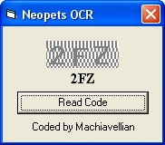



## Neopets OCR

### Description

July,1st 2004 - Neopets keeps changing the URL of the code. I've updated the OCR to reflect the change.

This program reads the new distorted Neopets magic code. Do whatever you wish with it, but if you incorporate any or all of it into your own programs, credit would be nice. A compiled version is available at geocities.com/machiavelliansquared
 
### More Info
 

             |
---                |---
**Submitted On**   |2004-07-01 09:04:16
**By**             |[Machiavellian](https://github.com/Planet-Source-Code/PSCIndex/blob/master/ByAuthor/machiavellian.md)
**Level**          |Beginner
**User Rating**    |5.0 (15 globes from 3 users)
**Compatibility**  |VB 6\.0
**Category**       |[Games](https://github.com/Planet-Source-Code/PSCIndex/blob/master/ByCategory/games__1-38.md)
**World**          |[Visual Basic](https://github.com/Planet-Source-Code/PSCIndex/blob/master/ByWorld/visual-basic.md)
**Archive File**   |[Neopets\_OC176448712004\.zip](https://github.com/Planet-Source-Code/machiavellian-neopets-ocr__1-54676/archive/master.zip)

